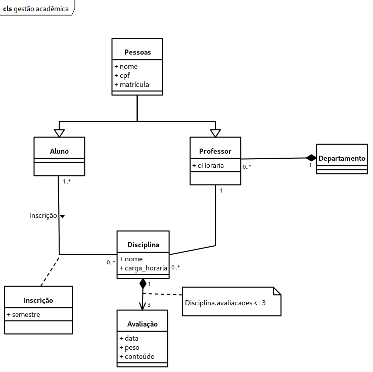

# Sistema de Gestão Acadêmica

Sistema constuído na disciplina EXA805 - ALGORITMOS E PROGRAMAÇÃO II 2023.1 para o aprendizado da Programação Orientada à Objetos e construção de interface de usuário com JavaFX.

### Conhecimentos adquiridos

- Classes e Objetos
- Interface
- Classe Abstrata
- Herança
- Padrão de Projeto DAO (Data Access Object)
- Padrão de Projeto Singleton
- Diagrama de Classes


### Diagrama de Classes



### Instalação

Faça o download do repositório

```
git clone https://github.com/rafatosta/gestao-academica.git
```

E abra o projeto no IntelliJ IDEA e aguarde o download das dependências.

## Executando os testes de unidade

Para rodar os testes de unidade execute o arquivo [GATestSuit.java](https://github.com/rafatosta/gestao-academica/blob/master/src/test/java/com/uefs/gestaoacademica/GATestSuit.java)

## Construído com

* [IntelliJ IDEA Community](https://www.jetbrains.com/idea/download/) - IDE utilizado para codificação
* [Maven](https://maven.apache.org/) - Gerente de Dependência
* [JavaFX](https://openjfx.io/) - Framework para o front-end
* [Scene Builder](https://gluonhq.com/products/scene-builder/) - Para construção das telas

